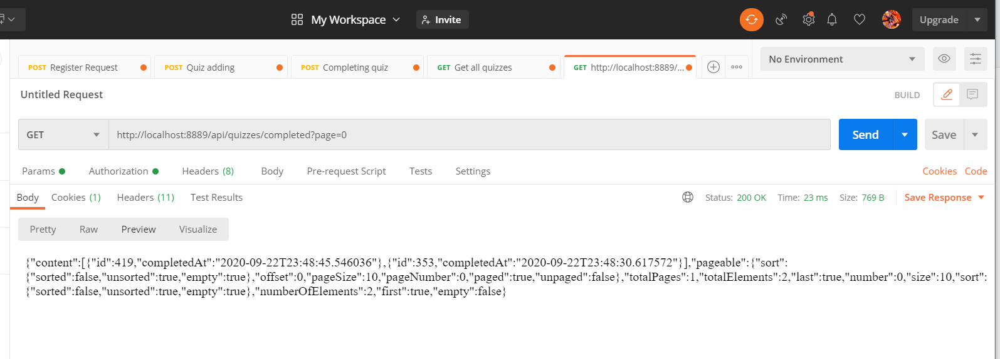

Web Quiz Engine -> Education project of Hyperskill.org

/api/quizzes:

  POST: Create a quiz.
  GET: Get all quizzes with paging.
  
  
 Get all quizzes

  
/api/quizzes/completed:
  GET: Get all completions of quizzes with paging
  

